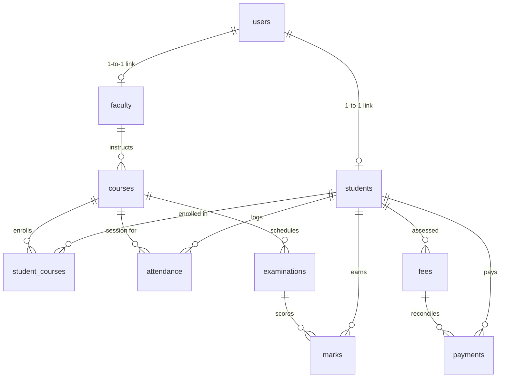

# AcademiaPro - Modern College Management System

A full-stack web application designed for comprehensive, centralized college and university administration. The platform connects administrators, faculty members, and students through dedicated, role-tailored responsive portals backed by a normalized relational database.

---

## 1. Project Overview

AcademiaPro minimizes institutional paperwork, eliminates human grading/balance discrepancies, provides audit trails for payments, and tracks daily academic metrics in real time.

All core features are directly wired to a database with proper relationships, foreign keys, unique constraints, server-side validation, password hashing, and session management.

---

## 2. Technology Stack

- **Frontend**: React 18, Vite, Tailwind CSS, Lucide Icons, Axios, React Router v6
- **Backend**: Node.js, Express.js REST APIs, JWT (JSON Web Tokens), bcryptjs, Helmet, Morgan, CORS
- **Database**: MySQL 8.0+ / MariaDB (InnoDB, Foreign Keys, Indexes, Transactions) with zero-config relational fallback capability
- **Testing**: Supertest API automation suite verifying authentication, RBAC, CRUD, attendance duplicate prevention, grade logic, and fee reconciliation

---

## 3. Key Features & Role Capabilities

### 👑 Administrator
- **Institutional Dashboard**: Aggregated metrics for active students, faculty, course offerings, fee collections, outstanding receivables, attendance rates, recent payments, and department enrollments.
- **Student Management**: Full CRUD, roll number search, department/semester filters, student profiles with tabbed views for course rosters, attendance breakdown, academic marks, and fee ledger.
- **Faculty Management**: Instructor appointment, employee IDs, department filters, and assigned courses.
- **Course & Curriculum Management**: Course codes, credits, department allocation, instructor assignment, and student enrollment roster management.
- **Attendance Oversight**: Review institutional attendance by course and session.
- **Examinations & Grading**: Schedule examinations, oversee marks, and verify letter grades computed by backend business logic.
- **Financial & Fee Management**: Fee assessment (Tuition, Lab, Library), due date tracking, payment collection with balance calculations, and official printable receipt generation.
- **Analytical Reports**: Multi-dimensional reports for Students, Faculty Workload, Attendance, Academic Marks, Fee Collections, and Courses with print and export capabilities.
- **User Account Administration**: Role assignment (`ADMIN`, `FACULTY`, `STUDENT`), password resets, and credential management.

### 👨‍🏫 Faculty Member
- **Faculty Dashboard**: Active courses count, total students taught, upcoming exams, and recent attendance sessions.
- **Course Rosters**: Syllabus details, credit allocations, and enrolled student directories.
- **Attendance Roll Call**: Daily attendance marker with "All Present" / "All Absent" shortcuts, duplicate entry prevention, and real-time attendance percentages.
- **Examination Marks Entry**: Enter scores for students in assigned course exams with real-time grade previews and backend validation (e.g. score cannot exceed maximum marks).

### 🎓 Student
- **Student Dashboard**: Cumulative attendance rate, pending balance alerts, registered course counts, and upcoming exam schedules.
- **Personal Profile**: Official roll number, department, semester, personal details, and account password management.
- **Enrolled Courses**: Course titles, credits, instructor details, and syllabus.
- **Attendance Performance**: Course-by-course attendance progress bars, class count breakdowns (Present / Late / Absent), and historical session logs.
- **Academic Transcript**: Term report card with marks obtained, maximum marks, percentages, and official letter grades (A+, A, B, C, D, F).
- **Fee Ledger & Payment Receipts**: Assessed fees, payments made, remaining balance, and printable official receipts.

---

## 4. Database Architecture & Schema Design

The system implements a normalized relational database schema defined in `database/schema.sql`:



### Core Relational Tables:
1. `departments` (`id`, `department_name`, `department_code` UNIQUE)
2. `users` (`id`, `username` UNIQUE, `email` UNIQUE, `password_hash`, `role` ENUM)
3. `students` (`id`, `user_id` FK, `roll_number` UNIQUE, `first_name`, `last_name`, `email` UNIQUE, `department`, `year`, `semester`, etc.)
4. `faculty` (`id`, `user_id` FK, `employee_id` UNIQUE, `first_name`, `last_name`, `email` UNIQUE, `department`, `designation`)
5. `courses` (`id`, `course_code` UNIQUE, `course_name`, `credits`, `department`, `semester`, `faculty_id` FK)
6. `student_courses` (`id`, `student_id` FK, `course_id` FK, `enrollment_date`, UNIQUE(`student_id`, `course_id`))
7. `attendance` (`id`, `student_id` FK, `course_id` FK, `date`, `status` ENUM, `marked_by` FK, UNIQUE(`student_id`, `course_id`, `date`))
8. `examinations` (`id`, `exam_name`, `exam_type`, `course_id` FK, `exam_date`, `semester`, `academic_year`)
9. `marks` (`id`, `student_id` FK, `examination_id` FK, `marks_obtained`, `maximum_marks`, `grade`, `entered_by` FK, UNIQUE(`student_id`, `examination_id`))
10. `fees` (`id`, `student_id` FK, `fee_type`, `amount`, `due_date`, `status` ENUM)
11. `payments` (`id`, `student_id` FK, `fee_id` FK, `transaction_id` UNIQUE, `amount_paid`, `payment_date`, `payment_method`, `status`)

---

## 5. Grading & Financial Business Logic

### Grading Key (Backend-Computed)
- **90% – 100%**: `A+`
- **80% – 89.9%**: `A`
- **70% – 79.9%**: `B`
- **60% – 69.9%**: `C`
- **50% – 59.9%**: `D`
- **Below 50%**: `F`

### Financial Reconciliation Logic
- `Pending Balance = Total Fee Amount - Total Verified Payments`
- If Total Payments == 0: Status is `PENDING`
- If 0 < Total Payments < Total Fee: Status is `PARTIAL`
- If Total Payments >= Total Fee: Status is `PAID`
- Rejects overpayment attempts greater than the remaining balance.

---

## 6. Default Demo Credentials

You can log in manually or click the **One-Click Demo Access** buttons on the login page:

| Role | Username | Password | Email | Linked Profile |
| :--- | :--- | :--- | :--- | :--- |
| **ADMIN** | `admin` | `Admin@123` | `admin@college.edu.in` | System Administrator |
| **FACULTY** | `prof.rajesh` | `Faculty@123` | `rajesh.sharma@college.edu.in` | Prof. Rajesh Sharma (HOD - CSE) |
| **FACULTY** | `prof.ananya` | `Faculty@123` | `ananya.iyer@college.edu.in` | Dr. Ananya Iyer (IT) |
| **STUDENT** | `student.rahul` | `Student@123` | `rahul.sharma@college.edu.in` | Rahul Sharma (Roll: 2024CSE001) |
| **STUDENT** | `student.sneha` | `Student@123` | `sneha.reddy@college.edu.in` | Sneha Reddy (Roll: 2024CSE002) |
| **STUDENT** | `student.aarav` | `Student@123` | `aarav.patel@college.edu.in` | Aarav Patel (Roll: 2024IT001) |
| **STUDENT** | `student.priya` | `Student@123` | `priya.nair@college.edu.in` | Priya Nair (Roll: 2024IT002) |

---

## 7. Installation & Quick Start

### Prerequisites
- Node.js (v18+)
- MySQL 8.0+ (optional, automatic relational engine fallback provided if MySQL server is not active)

### Step 1: Clone or Navigate to Directory
```bash
cd /Users/ashok/.gemini/antigravity/scratch/college-management-system
```

### Step 2: Configure Environment Variables
Copy `.env.example` to `backend/.env`:
```bash
cp .env.example backend/.env
```
Update your MySQL host, port, user, and password in `backend/.env` if using a local or remote MySQL server:
```env
DB_HOST=127.0.0.1
DB_PORT=3306
DB_USER=root
DB_PASSWORD=your_mysql_password
DB_NAME=college_db
```

### Step 3: Database Setup
Run the automated schema generator and seed loader:
```bash
cd backend
npm run db:init
npm run db:seed
```
*(Alternatively, import directly with MySQL CLI: `mysql -u root -p < ../database/schema.sql` followed by `mysql -u root -p < ../database/seed.sql`)*

### Step 4: Run Automated Tests
```bash
cd backend
npm test
```

### Step 5: Start the Full-Stack Application

**Option A — Express Production Server (Serves Backend APIs & React Client Together)**:
```bash
# In frontend: build production bundle
cd ../frontend && npm run build

# In backend: start server on port 5050
cd ../backend && npm start
```
Open **`http://localhost:5050`** in your browser.

**Option B — Independent Concurrent Development**:
```bash
# Terminal 1: Backend API server
cd backend && npm run dev

# Terminal 2: Vite React client
cd frontend && npm run dev
```
Open **`http://localhost:5173`** in your browser (Vite proxies all `/api` requests to port 5050).

---

## 8. REST API Documentation

### Authentication & Profiles
- `POST /api/auth/login`: Authenticate and obtain JWT token
- `GET /api/auth/me`: Retrieve current user profile and linked student/faculty data
- `POST /api/auth/change-password`: Update authenticated user password

### Dashboard Metrics
- `GET /api/dashboard`: Aggregated dashboard statistics tailored to user role (Admin, Faculty, Student)

### Students
- `GET /api/students`: List students with search, filters (department, semester, year), and pagination
- `GET /api/students/:id`: Get full student profile with enrolled courses, attendance summary, marks, and fees
- `POST /api/students`: Register new student and generate portal user account *(Admin only)*
- `PUT /api/students/:id`: Update student information *(Admin only)*
- `DELETE /api/students/:id`: Remove student record and linked account *(Admin only)*

### Faculty
- `GET /api/faculty`: List faculty members with search and department filters
- `GET /api/faculty/:id`: Faculty details with assigned courses and workload
- `POST /api/faculty`: Create faculty member and instructor login *(Admin only)*
- `PUT /api/faculty/:id`: Update faculty details *(Admin only)*
- `DELETE /api/faculty/:id`: Remove faculty member *(Admin only)*

### Courses & Enrollments
- `GET /api/courses`: List courses with faculty and enrolled student count
- `GET /api/courses/:id`: Course details with syllabus and enrolled student list
- `POST /api/courses`: Create new academic course *(Admin only)*
- `PUT /api/courses/:id`: Update course information *(Admin only)*
- `DELETE /api/courses/:id`: Remove course *(Admin only)*
- `POST /api/courses/:id/enroll`: Enroll student in course *(Admin only)*
- `DELETE /api/courses/:id/enroll/:studentId`: Unenroll student *(Admin only)*

### Attendance
- `GET /api/attendance`: Query attendance records by course, date, or student
- `POST /api/attendance`: Mark attendance (single or bulk) with duplicate prevention
- `GET /api/attendance/summary`: Cumulative attendance percentages by course and student

### Examinations & Marks
- `GET /api/examinations`: Scheduled examinations list
- `GET /api/examinations/:id`: Exam details with student score sheet
- `POST /api/examinations`: Schedule new examination
- `GET /api/marks`: Query recorded exam scores
- `POST /api/marks`: Record or update scores with backend grade computation
- `PUT /api/marks/:id`: Update specific score and re-compute grade

### Fees & Payments
- `GET /api/fees`: Fee assessments with paid amounts and remaining balances
- `POST /api/fees`: Create fee obligation for student *(Admin only)*
- `GET /api/payments`: Transaction history ledger
- `POST /api/payments`: Record payment, reconcile fee balance, and generate transaction ID *(Admin only)*
- `GET /api/payments/:id/receipt`: Full official receipt data

### Reports
- `GET /api/reports/students`: Student status, attendance %, and fee balances
- `GET /api/reports/faculty`: Instructor courses and student workload
- `GET /api/reports/attendance`: Course attendance rates
- `GET /api/reports/marks`: Exam grade distributions and pass/fail counts
- `GET /api/reports/fees`: Billed, collected, and outstanding revenues
- `GET /api/reports/courses`: Course curriculum enrollment breakdown

---

## 9. Project Directory Structure

```
college-management-system/
├── backend/
│   ├── config/
│   │   └── db.js            # Unified relational database connection pool & adapter
│   ├── controllers/         # Modular REST controllers for all domains
│   ├── middleware/          # JWT verification, RBAC guards, and centralized error handler
│   ├── routes/              # Express API route declarations
│   ├── utils/               # Grade calculation, transaction ID generator, seeders
│   ├── tests/               # Supertest API automation suite (31 assertions)
│   ├── app.js               # Express application configuration
│   ├── server.js            # Server entrypoint
│   └── package.json
│
├── frontend/
│   ├── src/
│   │   ├── components/      # DataTable, StatCard, Badge, Modal, ConfirmDialog, ReceiptModal
│   │   ├── context/         # AuthContext provider and authentication hook
│   │   ├── layouts/         # DashboardLayout, Sidebar, Navbar
│   │   ├── pages/
│   │   │   ├── auth/        # Login page with demo credentials
│   │   │   ├── admin/       # Complete administration views (Students, Faculty, Courses, etc.)
│   │   │   ├── faculty/     # Faculty views (Courses, Attendance, Marks)
│   │   │   └── student/     # Student views (Dashboard, Attendance, Marks, Fees)
│   │   ├── services/        # Axios API service with automatic JWT interceptor
│   │   ├── App.jsx          # React Router route tree with role guards
│   │   ├── main.jsx         # React DOM entrypoint
│   │   └── index.css        # Tailwind directives and print styles
│   ├── tailwind.config.js
│   ├── vite.config.js
│   └── package.json
│
├── database/
│   ├── schema.sql           # MySQL DDL (tables, keys, constraints, indexes)
│   ├── seed.sql             # Realistic demo dataset for all entities
│   └── README.md
│
├── .env.example
└── README.md
```
